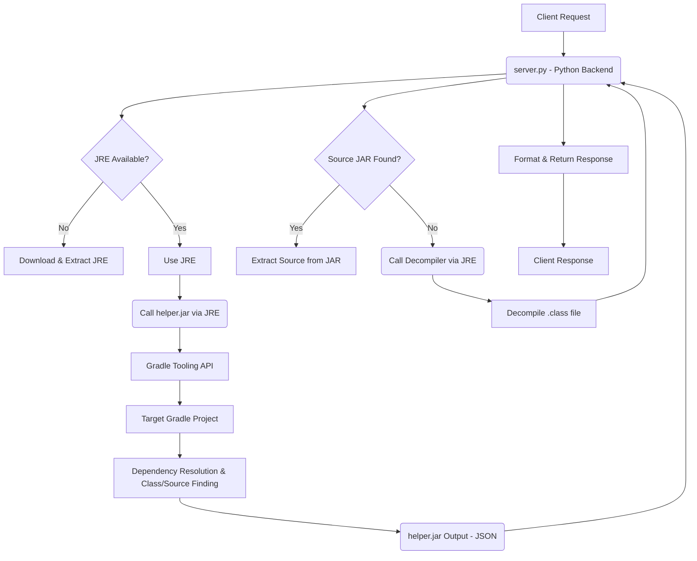

# Internal Design Document for Gradle Class Finder MCP

This document details the internal architecture and working mechanisms of the Gradle Class Finder MCP tool. It outlines how different components interact to achieve the goal of finding and providing class source code from Gradle project dependencies.

## 1. Overall Architecture

The Gradle Class Finder MCP is designed as a multi-component system, primarily orchestrated by a Python backend (`server.py`). It leverages a custom Java helper (`helper.jar`) for Gradle-specific interactions and a third-party Java decompiler for source code generation when original sources are unavailable. A key design principle is self-containment, achieved by bundling and managing its own Java Runtime Environment (JRE).

## 2. Component Breakdown

### 2.1. `server.py` (Python Backend)

This is the orchestrator of the entire system. Its responsibilities include:

*   **Request Handling:** Receives client requests (e.g., via CLI arguments or a conceptual HTTP interface) containing `project_path`, `class_name`, and optional `submodule_path`.
*   **JRE Management:** On startup, it checks for the presence of a bundled JRE. If not found, it automatically downloads and extracts a suitable JRE for the host OS and architecture into the `.java_runtime/` directory. All subsequent Java commands are executed using this managed JRE.
*   **`helper.jar` Invocation:** Constructs and executes a `java -jar` command to run the `helper.jar`. It passes the necessary parameters (project path, class name, submodule path) to the helper.
*   **Output Parsing:** Captures and parses the JSON output from `helper.jar`, which contains information about found classes, their JAR paths, and potential source JAR paths.
*   **Source Extraction/Decompilation Logic:** Based on the `helper.jar`'s output:
    *   If a source JAR is identified, it extracts the `.java` file corresponding to the `class_name` from the source JAR.
    *   If no source JAR is found, it invokes the bundled decompiler (`cfr.jar`) using the managed JRE to decompile the `.class` file from the binary JAR.
*   **Response Formatting:** Aggregates the retrieved source code (original or decompiled) and metadata into the defined JSON response format and returns it to the client.
*   **Error Handling:** Manages errors from JRE download, `helper.jar` execution, source extraction, or decompilation, providing informative error messages.

### 2.2. `helper.jar` (Java Helper - Located in `java_helper/`)

This is a small, self-contained Java application built with Gradle. Its primary function is to interact with Gradle projects programmatically using the Gradle Tooling API. It is designed to be invoked by `server.py`.

*   **Gradle Tooling API Integration:** Uses `org.gradle:gradle-tooling-api` to connect to the target Gradle project.
*   **Project Model Querying:** Connects to the specified `project_path` (and `submodule_path` if provided) and queries its `Project` model to access its dependency graph.
*   **Dependency Resolution:** Iterates through the `compileClasspath` of the target project/submodule to identify all JAR files.
*   **Class Location:** For each JAR, it checks if the specified `class_name` exists within it. This involves inspecting the JAR's contents (e.g., `com/example/MyClass.class`).
*   **Source JAR Discovery:** For each JAR containing the target class, it attempts to resolve and locate its corresponding source JAR (`-sources.jar`) using Gradle's dependency resolution capabilities.
*   **JSON Output:** Prints a JSON array of all found matches (including binary JAR path, source JAR path, and Maven/Gradle coordinates) to standard output, which `server.py` then consumes.

### 2.3. Decompiler (`cfr.jar` - Located in `decompilers/`)

This is a pre-built, third-party Java decompiler (e.g., CFR - Class File Reader). It is bundled directly with the tool.

*   **Function:** Converts Java bytecode (`.class` files) back into human-readable Java source code.
*   **Invocation:** Called by `server.py` via the managed JRE when a source JAR is not available for a found class.
*   **Output:** Prints the decompiled source code to standard output, which `server.py` captures.

### 2.4. JRE (`.java_runtime/`)

This directory stores the Java Runtime Environment downloaded and managed by `server.py`.

*   **Self-Contained:** Ensures the tool does not rely on a pre-installed Java environment on the host system.
*   **Platform-Specific:** `server.py` downloads the appropriate JRE distribution (e.g., Adoptium Temurin) based on the host operating system and architecture.
*   **Execution Context:** All Java-based components (`helper.jar`, `cfr.jar`) are executed using the `java` executable found within this directory.

## 3. Data Flow and Interactions

1.  **Client Request:** A client initiates a request to `server.py` with the target Gradle project details and class name.
2.  **JRE Check:** `server.py` ensures the JRE is available. If not, it downloads and extracts it.
3.  **Helper Invocation:** `server.py` spawns a new process to run `helper.jar` using the managed JRE. The helper receives parameters via command-line arguments.
4.  **Gradle Interaction:** `helper.jar` uses the Gradle Tooling API to connect to the specified Gradle project. This connection allows `helper.jar` to query the project's build model, including its dependencies.
5.  **Dependency Analysis:** `helper.jar` identifies all relevant JARs in the project's classpath that contain the target class. It also attempts to resolve corresponding source JARs.
6.  **Helper Output:** `helper.jar` prints a JSON string to its standard output, detailing all found matches (binary JAR path, source JAR path, dependency coordinates).
7.  **Python Processing:** `server.py` reads and parses the JSON output from `helper.jar`.
8.  **Source Retrieval Decision:** For each match:
    *   If `helper.jar` indicated a source JAR was found, `server.py` extracts the `.java` file from that source JAR.
    *   If no source JAR was found, `server.py` invokes the decompiler (`cfr.jar`) using the managed JRE, passing the binary JAR path and class name.
9.  **Decompiler Output:** The decompiler prints the decompiled Java source code to its standard output.
10. **Final Response:** `server.py` collects the source code (original or decompiled) and all associated metadata for each match, formats it into the final JSON response, and returns it to the client.

## 4. Future Considerations (as discussed)

*   More intelligent JRE management (version detection, cleanup).
*   Performance optimizations (Gradle model caching, decompiler result caching).
*   Enhanced error reporting and progress indicators.
*   Support for alternative decompilers.
*   Security considerations (JRE download source validation, file permissions).

This design aims for a robust, self-contained, and user-friendly solution for Gradle class source lookup.
